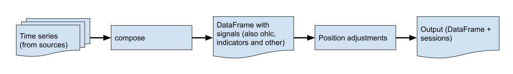

# Components

## Session (trading session)

A session starts from us adding or reducing position inside `on_entry` method.

A session is considered closed when its position is adjusted to zero.

A long session is a session that starts from adding to the position, a short session - starts from reducing the position.

Multiple open sessions can coexist at the same time.

Each session carries these attributes:

- `position`
- `transactions` (read-only)
- `take_profit`
- `stop_loss`
- `meta`

`position` adjustment creates a new `transaction` (combines both base and quote assets move).

`take_profit` and `stop_loss` - session brackets.

Brackets can use `percent`:
```python
from cipher import percent


session.take_profit = row['close'] * 1.015
session.take_profit = percent('1.5')  # +1.5% of current price for long session
session.stop_loss = percent('-1')  # -1% of current price for long session
session.stop_loss = None  # disable stop loss
```

`meta` - a dict-like object where we can store the session state.

## Position

Each new session has a position equal to 0 initially.

We can add to a position, or reduce a position (it can be negative).

Each position change creates a transaction.

There are multiple ways to adjust position:
```python
from cipher import base, percent, quote


session.position = 1
session.position = base(1)  # same as the one above
session.position = '1'  # int, str, float are being converted to Decimal
session.position = quote(100)  # sets position worth 100 quote asset
session.position += 1  # adds to the position
session.position -= Decimal('1.25')  # reduces position by 1.25
session.position += percent(50)  # adds 50% more position
session.position *= 1.5  # has the same effect as the one above
session.position = session.position.value + Decimal(1)  # not recommended
```

## Signals

There is one signal that is required - `entry`. We can define as many as we want.

To add a new signal:
- a bool column, with name equal the signal name, have to be present in the dataframe returned by compose method
- a signal handler has to be added to the strategy: `on_<signal name>`

on_entry is called only once for a new session.

`on_<signal>` is being called for each open session.

## Datas



Cipher supports multiple time series as input, they have to be combined into a single dataframe in the `compose` method.

To add datas:
```python
cipher.add_source("binance_spot_ohlc", symbol="BTCUSDT", interval="1h")
cipher.add_source("binance_spot_ohlc", symbol="ETHUSDT", interval="1h")
```

Then we can access data inside `compose`:
```python
def compose(self):
    self.datas[0]  # btcusdt ohlc
    self.datas[1]  # ethusdt ohlc
    self.datas.df  # shortcut for self.datas[0]
```

## Sources

Sources are reading data from apis, files, etc., in blocks and writes them to a file.

There are a few sources already included:

- `binance_futures_ohlc [symbol, interval]`
- `binance_spot_ohlc [symbol, interval]`
- `csv_file [path, ts_format]`
- `gateio_spot_ohlc [symbol, interval]`
- `yahoo_finance_ohlc [symbol, interval]`

## Strategy

Strategy explains Cipher when and how to adjust positions.

This is the interface:
```python
from pandas import DataFrame

from .models import Datas, Wallet
from .proxies import SessionProxy as Session


class Strategy:
    datas: Datas
    wallet: Wallet

    # def __init__(self, param1, param2):
    #     self.param1 = param1
    #     self.param2 = param2

    def compose(self) -> DataFrame:
        self.datas.df["entry"] = False
        return self.datas.df

    def on_entry(self, row: dict, session: Session) -> None:
        pass

    # def on_<signal>(self, row: dict, session: Session) -> None:
    #     pass

    def on_take_profit(self, row: dict, session: Session) -> None:
        session.position = 0

    def on_stop_loss(self, row: dict, session: Session) -> None:
        session.position = 0

    def on_stop(self, row: dict, session: Session) -> None:
        pass
```

Strategies are stored in files, you can generate a new one using this command:

```text
cipher new my_strategy
```

To run it:
```shell
python my_strategy.py
```

## Cipher instance

Cipher instance is a glue for Cipher components.

```python
cipher = Cipher()  # we can pass settings as kwargs, otherwise, settings will be loaded from .env or ENV variables
cipher.set_strategy(strategy_object)
cipher.set_commission(commission_or_commission_object)
cipher.add_source(source_name_or_source_object, **source_kwargs)
cipher.run(start_ts, stop_ts)  # process data according to the strategy and generate output
cipher.sessions  # returns sessions
cipher.stats  # builds and returns stats object
cipher.output  # raw output, contains the dataframe and sessions
cipher.plot(plotter_or_plotter_object_or_none, rows_or_none)  # if plotter or rows is not specified, the values will be automatically selected
```

## Commission

Commission is an objects that implements this interface:
```python
from abc import ABC, abstractmethod
from decimal import Decimal

from cipher.models.transaction import Transaction


class Commission(ABC):
    @abstractmethod
    def for_transaction(self, transaction: Transaction) -> Decimal:
        pass
```

`for_transaction` method returns how much quote asset have to be deducted.

By default, SimpleCommission is used, which returns the specified part from quote for each transaction.

Commission is only computed for stats and plotter, it does not apply to the output.

## Wallet

The wallet can be accessed from a strategy:
```python
self.wallet
```

Cipher wallet has two assets: base and quote, they both have 0 initially.

The wallet does not have any limits, and assets can go negative.

Transactions are being applied to a wallet adjusting the assets.

## Stats

Stats is the object returned by `cipher.stats` property.

We can use the stats for strategy performance evaluation.

## Plotters

Plotters take Output and build charts.

Currently, two plotters are available:

- [finplot](https://github.com/highfestiva/finplot) (doesn't work in jupyter notebooks)
- [mplfinance](https://github.com/matplotlib/mplfinance)

A custom plotter can be passed to `cipher.plot`.

Plotters accept rows, which describe to the plotter how to group charts,
use it if default layout does not fit your needs.

Rows can contain one of:

- `ohlc`
- `ohlcv`
- `signals`
- `position`
- `balance`
- `sessions`
- `brackets`
- `<indicator name>`

Example:
```python
rows = [['ohlc']]  # show only ohlc
rows = [['ohlc', 'ema50']]  # show ema50 as well (it should be present in the dataframe)
rows = [['ohlcv', 'sessions'], ['balance']]  # show ohlcv with session marks on the top chart and balance in the bottom
```

`plot` also accepts `limit` (number of rows to show) and `start` (where the plot starts).
`start` can be one of: datetime, offset, negative offset.

## Settings

Settings can be passed to Cipher as arguments or in `.env` or using ENV variables.

Available settings: `cache_root`, `log_level`.

`cache_root`. `cache_root` contains path to the cache folder. Default: `.cache`

If there are a few directories with strategies,
and we want to reuse one cache - we can specify the same cache_root for both.
