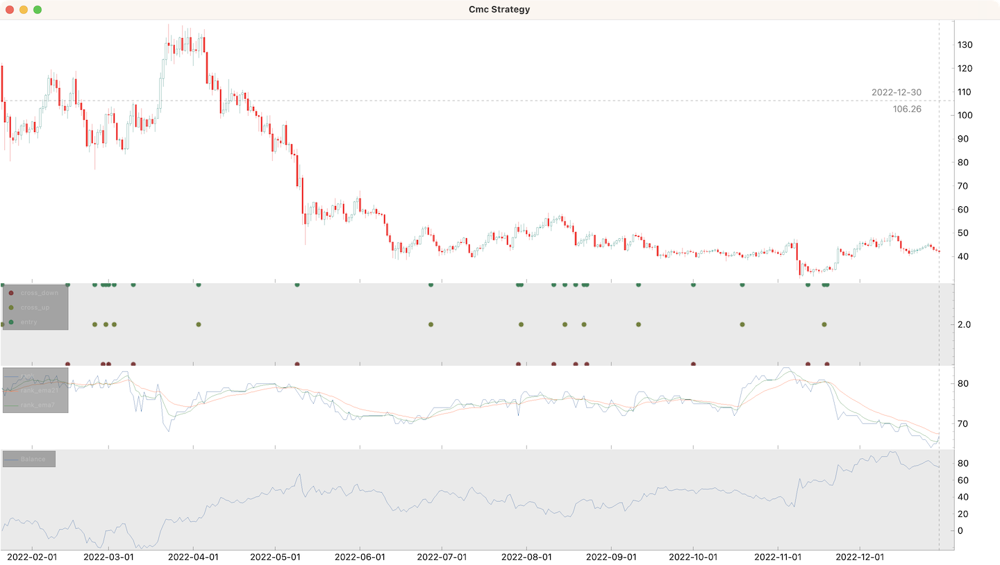

# CoinMarketCap rank + Binance spot OHLC for DASH

This example demonstrates how to use multiple data sources.

[CoinMarketCap rank for DASH](data/131_dash.csv) file contains daily [CoinMarketCap](https://coinmarketcap.com/) rank for DASH collected over 2022 year.

```python
import numpy as np
import pandas_ta as ta

from cipher import Cipher, Session, Strategy, quote


class CmcStrategy(Strategy):
    def compose(self):
        df = self.datas.df
        cmc_df = self.datas[1]

        df = df.join(cmc_df)
        df["rank"] = df["cmc_rank"].fillna(method="ffill")
        df["rank_ema21"] = ta.ema(df["rank"], length=21)
        df["rank_ema7"] = ta.ema(df["rank"], length=7)

        df["difference"] = df["rank_ema7"] - df["rank_ema21"]
        df["entry"] = np.sign(df["difference"].shift(1)) != np.sign(df["difference"])

        df["cross_up"] = df["entry"] & (df["difference"] > 0)
        df["cross_down"] = df["entry"] & (df["difference"] < 0)

        return df[df["difference"].notnull()]

    def on_entry(self, row: dict, session: Session):
        if row["cross_down"]:
            # buy dash worth 100 USD
            session.position += quote(100)
        else:
            session.position -= quote(100)

    def on_cross_up(self, row, session: Session):
        """Cross up is bearish, because the lower rank - the better."""
        if session.is_long:
            session.position = 0

    def on_cross_down(self, row, session: Session):
        if not session.is_long:
            session.position = 0

    def on_stop(self, row: dict, session: Session):
        session.position = 0


def main():
    cipher = Cipher()
    cipher.add_source("binance_spot_ohlc", symbol="DASHUSDT", interval="1d")
    cipher.add_source("csv_file", path="data/131_dash.csv")
    cipher.set_strategy(CmcStrategy())
    cipher.run(start_ts="2022-01-01", stop_ts="2022-12-31")
    print(cipher.sessions)
    print(cipher.stats)
    cipher.plot(
        rows=[
            ["ohlc"],
            ["signals"],
            ["rank", "rank_ema21", "rank_ema7"],
            ["balance"],
        ]
    )


if __name__ == "__main__":
    main()
```

Output:
```text
python cmc.py
Session                 Period           PnL
----------------------  --------  ----------
short 2022-01-21 00:00  24d         1.79754
long 2022-02-14 00:00   10d       -15.4143
short 2022-02-24 00:00  3d         -0.455581
long 2022-02-27 00:00   1d         13.9456
short 2022-02-28 00:00  1d          0.39801
long 2022-03-01 00:00   2d         -3.2967
short 2022-03-03 00:00  7d         -8.05785
long 2022-03-10 00:00   24d        26.7686
short 2022-04-03 00:00  36d        47.2851
long 2022-05-09 00:00   49d       -29.7568
short 2022-06-27 00:00  32d        -3.05499
long 2022-07-29 00:00   1d          0.197628
short 2022-07-30 00:00  12d        -9.66469
long 2022-08-11 00:00   4d         -4.31655
short 2022-08-15 00:00  4d         15.7895
long 2022-08-19 00:00   3d          5.58036
short 2022-08-22 00:00  1d         -2.537
long 2022-08-23 00:00   19d        -0.412371
short 2022-09-11 00:00  20d        13.6025
long 2022-10-01 00:00   18d        -4.86461
short 2022-10-19 00:00  24d        14.8615
long 2022-11-12 00:00   6d          2.04142
short 2022-11-18 00:00  1d         -3.21832
long 2022-11-19 00:00   41d        17.9494
----------------  ---------------------  -----
start             2022-01-21 00:00
stop              2022-12-30 00:00
period            343d
trades            24
longs             12                     50.0%
shorts            12                     50.0%
period median     8d 12h
period max        49d
success           12                     50.0%
success median    13.774031351671103224
success max       47.285067873303167421
success row       2
failure           12                     50.0%
failure median    3.806625029646612380
failure max       29.756795422031473533
failure row       2
spf               1.0
pnl               75.167382902613042311
commission        0E-18
balance min       -21.503915296725822
balance max       94.57749526216361
balance drawdown  51.459489382273404
romad             1.4607098477838074
----------------  ---------------------  -----
```


