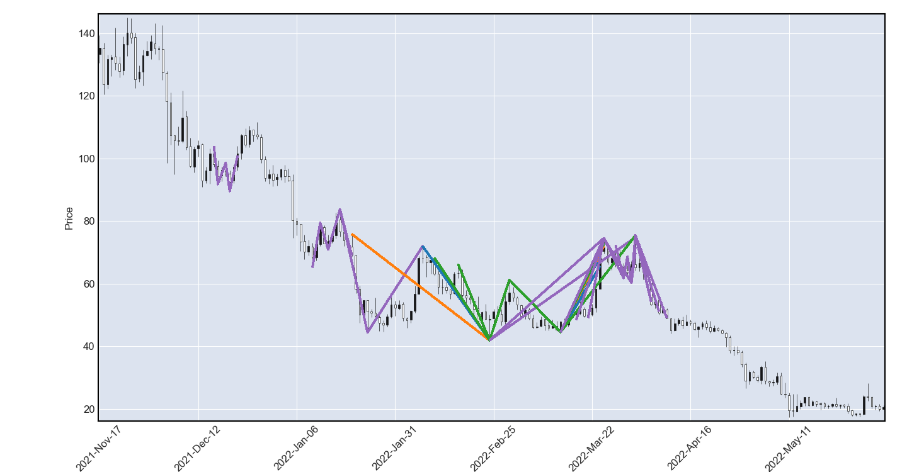

# Harmonic Trading Patterns

A backtest for [harmonic trading patterns](https://forextraininggroup.com/a-guide-to-harmonic-trading-patterns-in-the-currency-market/).

## Visualization

```python
from abc import ABC, abstractmethod
from typing import List

import mplfinance as mpf
import numpy as np
import requests
from pandas import DataFrame, to_datetime


class Pattern(ABC):
    def __init__(self, gap):
        self.gap = gap

    @abstractmethod
    def name(self):
        pass

    @abstractmethod
    def color(self):
        pass

    @abstractmethod
    def pass_ab(self, x, a, b) -> bool:
        pass

    @abstractmethod
    def pass_bc(self, x, a, b, c) -> List[float]:
        pass


class Gartley(Pattern):
    def name(self):
        return "Gartley"

    def color(self):
        return "C0"

    def pass_ab(self, x, a, b) -> bool:
        p = (a - b) / (a - x)
        return 0.618 - self.gap <= p <= 0.618 + self.gap

    def pass_bc(self, x, a, b, c) -> List[float]:
        p = (c - b) / (a - b)
        if 0.382 - self.gap <= p <= 0.382 + self.gap:
            return [c - (c - b) * 1.272, a - (a - x) * 0.786]
        if 0.886 - self.gap <= p <= 0.886 + self.gap:
            return [c - (c - b) * 1.618, a - (a - x) * 0.786]
        return []


class Bat(Pattern):
    def name(self):
        return "Bat"

    def color(self):
        return "C1"

    def pass_ab(self, x, a, b) -> bool:
        p = (a - b) / (a - x)
        return (0.382 - self.gap <= p <= 0.382 + self.gap) or (
            0.5 - self.gap <= p <= 0.5 + self.gap
        )

    def pass_bc(self, x, a, b, c) -> List[float]:
        p = (c - b) / (a - b)
        if 0.382 - self.gap <= p <= 0.382 + self.gap:
            return [c - (c - b) * 1.682, a - (a - x) * 0.886]
        if 0.886 - self.gap <= p <= 0.886 + self.gap:
            return [c - (c - b) * 2.618, a - (a - x) * 0.886]
        return []


class Butterfly(Pattern):
    def name(self):
        return "Butterfly"

    def color(self):
        return "C2"

    def pass_ab(self, x, a, b) -> bool:
        p = (a - b) / (a - x)
        return 0.786 - self.gap <= p <= 0.786 + self.gap

    def pass_bc(self, x, a, b, c) -> List[float]:
        p = (c - b) / (a - b)
        if 0.382 - self.gap <= p <= 0.382 + self.gap:
            return [c - (c - b) * 1.618, a - (a - x) * 1.27, a - (a - x) * 1.618]
        if 0.886 - self.gap <= p <= 0.886 + self.gap:
            return [c - (c - b) * 2.618, a - (a - x) * 1.27, a - (a - x) * 1.618]
        return []


class Crab(Pattern):
    def name(self):
        return "Crab"

    def color(self):
        return "C3"

    def pass_ab(self, x, a, b) -> bool:
        p = (a - b) / (a - x)
        return (0.382 - self.gap <= p <= 0.382 + self.gap) or (
            0.618 - self.gap <= p <= 0.618 + self.gap
        )

    def pass_bc(self, x, a, b, c) -> List[float]:
        p = (c - b) / (a - b)
        if 0.382 - self.gap <= p <= 0.382 + self.gap:
            return [c - (c - b) * 2.24, a - (a - x) * 1.618]
        if 0.886 - self.gap <= p <= 0.886 + self.gap:
            return [c - (c - b) * 3.618, a - (a - x) * 1.618]
        return []


class Cypher(Pattern):
    def name(self):
        return "Cypher"

    def color(self):
        return "C4"

    def pass_ab(self, x, a, b) -> bool:
        p = (a - b) / (a - x)
        return (0.382 - self.gap <= p <= 0.382 + self.gap) or (
            0.618 - self.gap <= p <= 0.618 + self.gap
        )

    def pass_bc(self, x, a, b, c) -> List[float]:
        p = (c - b) / (a - b)
        if 1.13 - self.gap <= p <= 1.414 + self.gap:
            return [c - (c - x) * 0.786]
        return []


patterns = [
    Gartley(gap=0.1),
    Bat(gap=0.1),
    Butterfly(gap=0.1),
    Crab(gap=0.1),
    Cypher(gap=0.1),
]


def get_df():
    columns = [
        ("ts", "int"),
        ("volume", "float64"),
        ("open", "float64"),
        ("high", "float64"),
        ("low", "float64"),
        ("close", "float64"),
    ]
    url = "https://api.gateio.ws/api/v4/spot/candlesticks?currency_pair=AXS_USDT&interval=1d&limit=200&from={}".format(
        1680321600 - 3600 * 24 * 500
    )
    response = requests.get(url)

    rows = response.json()

    df = (
        DataFrame([r[: len(columns)] for r in rows], columns=[i[0] for i in columns])
        .astype(dict(columns))
        .set_index("ts")
    )
    df.index = to_datetime(df.index, unit="s")

    return df


def _is_high(values) -> bool:
    return (
        values.iat[1]
        if values.iat[1] > values.iat[0] and values.iat[1] > values.iat[2]
        else np.NaN
    )


def _is_low(values) -> bool:
    return (
        values.iat[1]
        if values.iat[1] < values.iat[0] and values.iat[1] < values.iat[2]
        else np.NaN
    )


def main():
    df = get_df()

    # find pivots
    df = df.drop(df[df["high"].shift() == df["high"]].index).drop(
        df[df["low"].shift() == df["low"]].index
    )

    pivots = []

    df["pivot_high"] = df["high"].rolling(3, center=True).apply(_is_high)
    for index, not_null in enumerate(df["pivot_high"].notnull()):
        if not not_null:
            continue
        pivots.append((True, df.iat[index, len(df.columns) - 1], index, []))

    df["pivot_low"] = df["low"].rolling(3, center=True).apply(_is_low)
    for index, not_null in enumerate(df["pivot_low"].notnull()):
        if not not_null:
            continue
        pivots.append((False, df.iat[index, len(df.columns) - 1], index, []))

    pivots = list(sorted(pivots, key=lambda j: j[2]))

    for n, pivot in enumerate(pivots):
        if n == len(pivots) - 1:
            break
        prev = None
        for i in range(n + 1, len(pivots) - 1):
            p = pivots[i]
            if pivot[0]:
                if p[1] > pivot[1]:
                    break
                if p[0]:
                    continue
                if prev:
                    if p[1] < prev[1]:
                        pivot[3].append(i)
                        prev = p
                else:
                    if p[1] >= pivot[1]:
                        break
                    if pivot[2] == p[2]:
                        continue
                    pivot[3].append(i)
                    prev = p
            else:
                if p[1] < pivot[1]:
                    break
                if not p[0]:
                    continue
                if prev:
                    if p[1] > prev[1]:
                        pivot[3].append(i)
                        prev = p
                else:
                    if p[1] <= pivot[1]:
                        break
                    if pivot[2] == p[2]:
                        continue
                    pivot[3].append(i)
                    prev = p

    alines = {
        "alines": [],
        "colors": [],
    }
    points = []
    for x in pivots:
        for ai in x[3]:
            a = pivots[ai]
            for bi in a[3]:
                b = pivots[bi]
                for ci in b[3]:
                    c = pivots[ci]
                    for pattern in patterns:
                        if not pattern.pass_ab(x=x[1], a=a[1], b=b[1]):
                            continue
                        d = pattern.pass_bc(x=x[1], a=a[1], b=b[1], c=c[1])
                        if not d:
                            continue
                        for i in range(c[2] + 1, len(df.index)):
                            high = df.iat[i, 2]
                            low = df.iat[i, 3]
                            found = False
                            if a[0]:
                                if high > c[1]:
                                    break
                                for dd in d:
                                    if low <= dd <= high:
                                        alines["alines"].append(
                                            (
                                                (df.index[x[2]], x[1]),
                                                (df.index[a[2]], a[1]),
                                                (df.index[b[2]], b[1]),
                                                (df.index[c[2]], c[1]),
                                                (df.index[i], dd),
                                            )
                                        )
                                        alines["colors"].append(pattern.color())
                                        points.append((i, True, dd))
                                        found = True

                            else:
                                if low < c[1]:
                                    break
                                for dd in d:
                                    if low <= dd <= high:
                                        alines["alines"].append(
                                            (
                                                (df.index[x[2]], x[1]),
                                                (df.index[a[2]], a[1]),
                                                (df.index[b[2]], b[1]),
                                                (df.index[c[2]], c[1]),
                                                (df.index[i], dd),
                                            )
                                        )
                                        alines["colors"].append(pattern.color())
                                        points.append((i, False, dd))
                                        found = True
                            if found:
                                break

    df["bull"] = np.NaN
    df["bear"] = np.NaN
    bull_index = len(df.columns) - 2
    bear_index = len(df.columns) - 1

    points = set(points)

    for index, is_bull, price in points:
        if is_bull:
            df.iat[index, bull_index] = price
        else:
            df.iat[index, bear_index] = price

    ap = [
        # mpf.make_addplot(
        #     df["pivot_high"],
        #     type="scatter",
        #     marker="v",
        #     color="red",
        # ),
        # mpf.make_addplot(
        #     df["pivot_low"],
        #     type="scatter",
        #     marker="^",
        #     color="red",
        # ),
    ]

    # if df["bull"].any():
    #     ap.append(
    #         mpf.make_addplot(
    #             df["bull"],
    #             type="scatter",
    #             marker="^",
    #             color="green",
    #         )
    #     )
    #
    # if df["bear"].any():
    #     ap.append(
    #         mpf.make_addplot(
    #             df["bear"],
    #             type="scatter",
    #             marker="v",
    #             color="red",
    #         ),
    #     )

    mpf.plot(
        df,
        type="candle",
        addplot=ap,
        tight_layout=True,
        alines=alines,
    )


if __name__ == "__main__":
    main()
```



## Backtest

Stop: 1.618 of AX.
Take profit/stop ration = 1:1.

```python
import math

import numpy as np
from pandas import DataFrame
from cipher import Cipher, Session, Strategy, quote
from cipher.utils.decimals import float_to_decimal


def _is_high(values) -> bool:
    return (
        values.iat[1]
        if values.iat[1] > values.iat[0] and values.iat[1] > values.iat[2]
        else np.NaN
    )


def _is_low(values) -> bool:
    return (
        values.iat[1]
        if values.iat[1] < values.iat[0] and values.iat[1] < values.iat[2]
        else np.NaN
    )


class HarmonicStrategy(Strategy):
    def compose(self) -> DataFrame:
        df = self.datas.df.drop(
            self.datas.df[self.datas.df["high"].shift() == self.datas.df["high"]].index
        ).drop(
            self.datas.df[self.datas.df["low"].shift() == self.datas.df["low"]].index
        )

        pivots = []

        df["pivot_high"] = df["high"].rolling(3, center=True).apply(_is_high)
        for index, not_null in enumerate(df["pivot_high"].notnull()):
            if not not_null:
                continue
            pivots.append((True, df.iat[index, len(df.columns) - 1], index, []))

        df["pivot_low"] = df["low"].rolling(3, center=True).apply(_is_low)
        for index, not_null in enumerate(df["pivot_low"].notnull()):
            if not not_null:
                continue
            pivots.append((False, df.iat[index, len(df.columns) - 1], index, []))

        pivots = list(sorted(pivots, key=lambda j: j[2]))

        for n, pivot in enumerate(pivots):
            if n == len(pivots) - 1:
                break
            prev = None
            for i in range(n + 1, len(pivots) - 1):
                p = pivots[i]
                if pivot[0]:
                    if p[1] > pivot[1]:
                        break
                    if p[0]:
                        continue
                    if prev:
                        if p[1] < prev[1]:
                            pivot[3].append(i)
                            prev = p
                    else:
                        if p[1] >= pivot[1]:
                            break
                        if pivot[2] == p[2]:
                            continue
                        pivot[3].append(i)
                        prev = p
                else:
                    if p[1] < pivot[1]:
                        break
                    if not p[0]:
                        continue
                    if prev:
                        if p[1] > prev[1]:
                            pivot[3].append(i)
                            prev = p
                    else:
                        if p[1] <= pivot[1]:
                            break
                        if pivot[2] == p[2]:
                            continue
                        pivot[3].append(i)
                        prev = p

        longs = []
        shorts = []
        for x in pivots:
            for ai in x[3]:
                a = pivots[ai]
                for bi in a[3]:
                    b = pivots[bi]
                    for ci in b[3]:
                        c = pivots[ci]
                        for pattern in patterns:
                            if not pattern.pass_ab(x=x[1], a=a[1], b=b[1]):
                                continue
                            d = pattern.pass_bc(x=x[1], a=a[1], b=b[1], c=c[1])
                            if not d:
                                continue
                            for i in range(c[2] + 1, len(df.index)):
                                high = df.iat[i, 1]
                                low = df.iat[i, 2]
                                found = False
                                if a[0]:
                                    if high > c[1]:
                                        break
                                    for dd in d:
                                        if low <= dd <= high:
                                            longs.append((df.index[i], dd, a[1] - x[1]))
                                            found = True
                                else:
                                    if low < c[1]:
                                        break
                                    for dd in d:
                                        if low <= dd <= high:
                                            shorts.append(
                                                (df.index[i], dd, x[1] - a[1])
                                            )
                                            found = True
                                if found:
                                    break

        df["bull"] = np.NaN
        df["bear"] = np.NaN
        df["stop"] = np.NaN
        df["entry"] = False

        for ts, price, ax in longs:
            df.at[ts, "bull"] = price
            df.at[ts, "stop"] = ax * 1.618
            df.at[ts, "entry"] = True

        for ts, price, ax in shorts:
            df.at[ts, "bear"] = price
            df.at[ts, "stop"] = ax * 1.618
            df.at[ts, "entry"] = True

        return df

    def on_entry(self, row: dict, session: Session):
        if not math.isnan(row["bull"]):
            with session._cursor.patch_price(float_to_decimal(row["bull"])):
                session.position += quote(100)
                session.stop = row["bull"] - row["stop"]
                session.take_profit = row["bull"] + row["stop"]
        else:
            with session._cursor.patch_price(float_to_decimal(row["bear"])):
                session.position -= quote(100)
                session.stop = row["bear"] + row["stop"]
                session.take_profit = row["bear"] - row["stop"]

    def on_stop(self, row: dict, session: Session) -> None:
        session.position = 0


def main():
    cipher = Cipher()
    cipher.add_source("binance_spot_ohlc", symbol="BTCUSDT", interval="6h")
    cipher.set_strategy(HarmonicStrategy())
    cipher.run(start_ts="2022-08-01", stop_ts="2023-04-01")
    print(cipher.sessions)
    print(cipher.stats)
    cipher.plot(
        rows=[
            ["ohlc", "sessions"],
            ["position"],
            ["balance"],
        ]
    )


if __name__ == "__main__":
    main()
```
