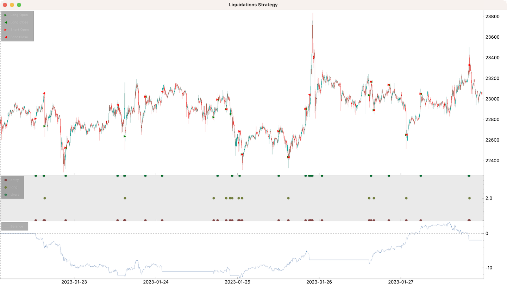

# Liquidations

This example shows how to resample time series. It uses 5 minutes interval,
in this interval we count how many 10 seconds spans had liquidations,
and if the number breaks the threshold - we start and new trading session.  

The `liquidations.csv` looks like this:
```csv
ts,trade_time,symbol,side,order_type,order_status,time_in_force,original_quantity,price,average_price,last_filled_quantity,filled_accumulated_quantity
1674374499889,1674374499884,BTCUSDT,SELL,LIMIT,FILLED,IOC,0.005,22806.20,22896.60,0.005,0.005
1674374553356,1674374553353,BTCUSDT,SELL,LIMIT,FILLED,IOC,0.009,22792.58,22881.50,0.008,0.009
1674374563396,1674374563393,BTCUSDT,SELL,LIMIT,FILLED,IOC,0.569,22785.32,22874.30,0.016,0.569
```

```python
from cipher import Cipher, Session, Strategy


class LiquidationsStrategy(Strategy):
    def __init__(self):
        self.latest_direction = None

    def compose(self):
        df = self.datas[0]
        liquidations_df = self.datas[1][["side", "filled_accumulated_quantity"]]

        df["buys"] = self.count_10_seconds_samples(
            liquidations_df[liquidations_df["side"] == "BUY"]
        )
        df["sells"] = self.count_10_seconds_samples(
            liquidations_df[liquidations_df["side"] == "SELL"]
        )

        df["long"] = df["sells"] > 10
        df["short"] = df["buys"] > 10

        df["entry"] = df["long"] | df["short"]

        return df

    def count_10_seconds_samples(self, source):
        """How many 10 seconds samples have liquidations."""
        df = source.resample("10s").agg({"filled_accumulated_quantity": "sum"})
        df["exist"] = df["filled_accumulated_quantity"] > 0
        df["exist"] = df["exist"].replace({True: 1, False: 0, None: 0})
        return df.resample("5min").agg({"exist": "sum"})["exist"]

    def on_entry(self, row: dict, session: Session):
        if row["long"]:
            if self.latest_direction != "long":
                session.position += "0.01"
                self.latest_direction = "long"
        else:
            if self.latest_direction != "short":
                session.position -= "0.01"
                self.latest_direction = "short"

    def on_long(self, row: dict, session: Session):
        session.position = 0

    def on_short(self, row: dict, session: Session):
        session.position = 0


def main():
    cipher = Cipher()
    cipher.add_source("binance_futures_ohlc", symbol="BTCUSDT", interval="5m")
    cipher.add_source("csv_file", path="data/liquidations.csv")
    cipher.set_strategy(LiquidationsStrategy())
    cipher.run(start_ts="2023-01-20", stop_ts="2023-01-28")
    cipher.set_commission("0.0025")
    print(cipher.stats)
    cipher.plot(rows=[["ohlc", "sessions"], ["signals"], ["balance"]], limit=1700)


if __name__ == "__main__":
    main()
```



```text
----------------  -------------------  -----
start             2023-01-20 00:00
stop              2023-01-27 23:55
period            7d 23h 55m
trades            19
longs             9                    47.4%
shorts            10                   52.6%
period median     4h 15m
period max        15h 15m
success           11                   57.9%
success median    1.40603500
success max       3.70829250
success row       5
failure           8                    42.1%
failure median    2.88356375
failure max       5.30065500
failure row       3
spf               1.375
pnl               -1.96706250
volume            0.38
commission        21.7160625
exposed period    3d 17h 22m 40s       46.0%
balance min       -12.904080000000022
balance max       3.2301750000000027
balance drawdown  12.904080000000022
romad             -0.1524372524038906
----------------  -------------------  -----
```
