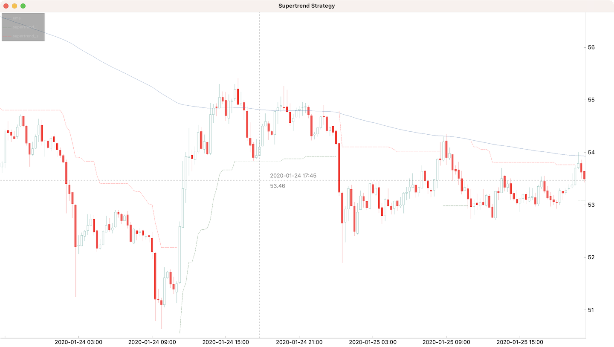
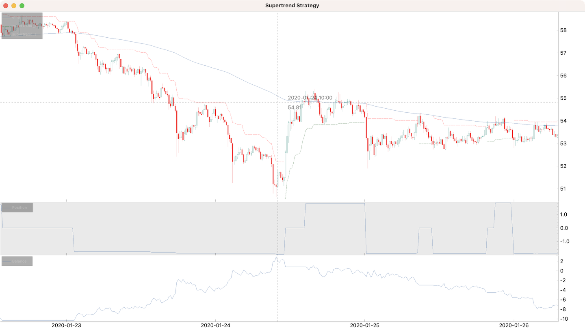

# Supertrend

<iframe width="480" height="270" src="https://www.youtube.com/embed/GKNVmb82IfE" frameborder="0" allowfullscreen></iframe>
<br />

## Indicators

```python
from cipher import Cipher, Strategy


class SupertrendStrategy(Strategy):
    def compose(self):
        df = self.datas.df

        df["ema"] = df.ta.ema(length=200)

        supertrend = self.datas.df.ta.supertrend()
        df["supertrend_l"] = supertrend["SUPERTl_7_3.0"]
        df["supertrend_s"] = supertrend["SUPERTs_7_3.0"]

        return df


def main():
    cipher = Cipher()
    cipher.add_source("binance_spot_ohlc", symbol="LTCUSDT", interval="15m")
    cipher.set_strategy(SupertrendStrategy())
    cipher.run(start_ts="2020-01-01", stop_ts="2020-02-01")
    cipher.plot(
        rows=[
            [
                "ohlc",
                "ema",
                "supertrend_l|_|green",
                "supertrend_s|_|red",
            ],
        ]
    )


if __name__ == "__main__":
    main()
```



## Signals and position adjustment

```python
from cipher import Cipher, Session, Strategy, quote


class SupertrendStrategy(Strategy):
    def compose(self):
        df = self.datas.df

        df["ema"] = df.ta.ema(length=200)

        supertrend = self.datas.df.ta.supertrend()
        df["supertrend_l"] = supertrend["SUPERTl_7_3.0"]
        df["supertrend_s"] = supertrend["SUPERTs_7_3.0"]

        hlc3 = (df["high"] + df["low"] + df["close"]) / 3

        df["long"] = (hlc3 > df["ema"]) & (hlc3 > df["supertrend_l"])
        df["short"] = (hlc3 < df["ema"]) & (hlc3 < df["supertrend_s"])

        df["entry"] = df["long"] | df["short"]

        return df

    def on_entry(self, row: dict, session: Session):
        if self.wallet.base:
            return

        if row["long"]:
            session.position += quote(100)
            session.stop_loss = row["supertrend_l"]
            session.take_profit = (
                row["close"] + (row["close"] - row["supertrend_l"]) * 1.5
            )
        else:
            session.position -= quote(100)
            session.stop_loss = row["supertrend_s"]
            session.take_profit = (
                row["close"] - (row["supertrend_s"] - row["close"]) * 1.5
            )

    def on_long(self, row: dict, session: Session):
        session.stop_loss = max(row["supertrend_l"], session.stop_loss)

    def on_short(self, row: dict, session: Session):
        session.stop_loss = min(row["supertrend_s"], session.stop_loss)


def main():
    cipher = Cipher()
    cipher.add_source("binance_spot_ohlc", symbol="LTCUSDT", interval="15m")
    cipher.set_strategy(SupertrendStrategy())
    cipher.run(start_ts="2020-01-01", stop_ts="2020-02-01")
    cipher.plot(
        rows=[
            [
                "ohlc",
                "ema",
                "supertrend_l|_|green",
                "supertrend_s|_|red",
            ],
            ["position"],
            ["balance"],
        ],
    )


if __name__ == "__main__":
    main()
```


