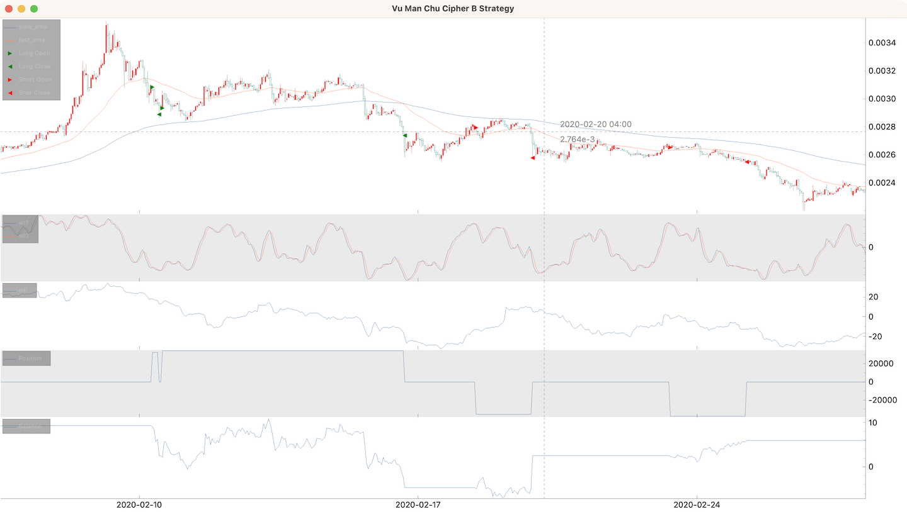
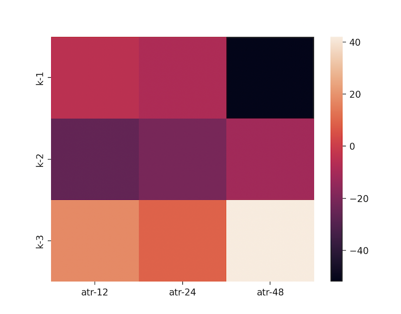

# VuManChu Cipher B

Here we will extract indicators from a [TradingView](https://www.tradingview.com/) pine script, use them to build a strategy,
and optimize the strategy parameters. 

The strategy was found here:
<iframe width="480" height="270" src="https://www.youtube.com/embed/3RvKWdnrs2g" frameborder="0" allowfullscreen></iframe>
<br />

## Indicators

The waves from VuManChu Cipher B in pine look similar to:
```text
chlen = 9
avg = 12
malen = 3
esa = ema(hlc3, chlen)
de = ema(abs(hlc3 - esa), chlen)
ci = (hlc3 - esa) / (0.015 * de)
wt1 = ema(ci, avg)
wt2 = sma(wt1, malen)
```

Using the same idea when composing the pandas dataframe:
```python
import pandas_ta as ta

from cipher import Cipher, Strategy


class VuManChuCipherBStrategy(Strategy):
    def __init__(
        self,
        wave_channel_length=9,
        wave_average_length=12,
        wave_ma_length=3,
        wave_k=0.015,
        mfi_length=60,
        slow_ema_length=200,
        fast_ema_length=50,
    ):
        self.wave_channel_length = wave_channel_length
        self.wave_average_length = wave_average_length
        self.wave_ma_length = wave_ma_length
        self.wave_k = wave_k
        self.mfi_length = mfi_length
        self.slow_ema_length = slow_ema_length
        self.fast_ema_length = fast_ema_length

    def compose(self):
        df = self.datas.df

        hlc3 = (df["high"] + df["low"] + df["close"]) / 3
        esa = ta.ema(hlc3, length=self.wave_channel_length)
        de = ta.ema(abs(hlc3 - esa), length=self.wave_channel_length)
        ci = (hlc3 - esa) / (de * self.wave_k)

        df["wt1"] = ta.ema(ci, length=self.wave_average_length)
        df["wt2"] = ta.sma(df["wt1"], length=self.wave_ma_length)
        df["mfi"] = df.ta.mfi(length=self.mfi_length)
        df["fast_ema"] = df.ta.ema(length=self.fast_ema_length)
        df["slow_ema"] = df.ta.ema(length=self.slow_ema_length)

        df["entry"] = None

        return df[df["slow_ema"].notnull()]


def main():
    cipher = Cipher()
    cipher.add_source("gateio_spot_ohlc", symbol="DOGE_USDT", interval="1h")
    cipher.set_strategy(VuManChuCipherBStrategy())
    cipher.run(start_ts="2020-01-01", stop_ts="2020-04-01")
    cipher.plot(
        rows=[
            ["ohlc", "slow_ema", "fast_ema"],
            ["wt1", "wt2"],
            ["mfi"],
        ]
    )


if __name__ == "__main__":
    main()
```

## Signals

Enter long:

- close > slow_ema
- low < fast_ema
- mfi > 0
- wt1 < 0
- wt1 cross wt2 from below

Enter short:

- close < slow_ema
- low > fast_ema
- mfi < 0
- wt1 > 0
- wt1 cross wt2 from above

```python
import pandas_ta as ta
import numpy as np

from cipher import Cipher, Strategy


class VuManChuCipherBStrategy(Strategy):
    def __init__(
        self,
        wave_channel_length=9,
        wave_average_length=12,
        wave_ma_length=3,
        wave_k=0.015,
        mfi_length=60,
        atr_length=24,
        slow_ema_length=200,
        fast_ema_length=50,
    ):
        self.wave_channel_length = wave_channel_length
        self.wave_average_length = wave_average_length
        self.wave_ma_length = wave_ma_length
        self.wave_k = wave_k
        self.mfi_length = mfi_length
        self.atr_length = atr_length
        self.slow_ema_length = slow_ema_length
        self.fast_ema_length = fast_ema_length

    def compose(self):
        df = self.datas.df

        hlc3 = (df["high"] + df["low"] + df["close"]) / 3
        esa = ta.ema(hlc3, length=self.wave_channel_length)
        de = ta.ema(abs(hlc3 - esa), length=self.wave_channel_length)
        ci = (hlc3 - esa) / (de * self.wave_k)

        df["wt1"] = ta.ema(ci, length=self.wave_average_length)
        df["wt2"] = ta.sma(df["wt1"], length=self.wave_ma_length)
        df["mfi"] = df.ta.mfi(length=self.mfi_length) - 50
        df["atr"] = df.ta.atr(length=self.atr_length)
        df["fast_ema"] = df.ta.ema(length=self.fast_ema_length)
        df["slow_ema"] = df.ta.ema(length=self.slow_ema_length)

        difference = df["wt2"] - df["wt1"]
        cross = np.sign(difference.shift(1)) != np.sign(difference)

        df["long_entry"] = (
            (df["close"] > df["slow_ema"])
            & (df["low"] < df["fast_ema"])
            & (df["mfi"] > 0)
            & (df["wt1"] < 0)
            & cross
            & (difference < 0)
        )
        df["short_entry"] = (
            (df["close"] < df["slow_ema"])
            & (df["low"] > df["fast_ema"])
            & (df["mfi"] < 0)
            & (df["wt1"] > 0)
            & cross
            & (difference > 0)
        )

        df["entry"] = df["long_entry"] | df["short_entry"]

        return df[df["slow_ema"].notnull()]


def main():
    cipher = Cipher()
    cipher.add_source("gateio_spot_ohlc", symbol="DOGE_USDT", interval="1h")
    cipher.set_strategy(VuManChuCipherBStrategy())
    cipher.run(start_ts="2020-01-01", stop_ts="2020-04-01")
    cipher.plot(
        rows=[
            ["ohlc", "slow_ema", "fast_ema"],
            ["signals"],
            ["wt1", "wt2"],
            ["mfi"],
        ]
    )


if __name__ == "__main__":
    main()
```

## Position

Take profit = 2x stop loss.

```python
import pandas_ta as ta
import numpy as np

from cipher import Cipher, Session, Strategy, quote


class VuManChuCipherBStrategy(Strategy):
    def __init__(
        self,
        wave_channel_length=9,
        wave_average_length=12,
        wave_ma_length=3,
        wave_k=0.015,
        mfi_length=60,
        atr_length=24,
        stop_loss_k=2,
        take_profit_k=4,
        slow_ema_length=200,
        fast_ema_length=50,
    ):
        self.wave_channel_length = wave_channel_length
        self.wave_average_length = wave_average_length
        self.wave_ma_length = wave_ma_length
        self.wave_k = wave_k
        self.mfi_length = mfi_length
        self.atr_length = atr_length
        self.stop_loss_k = stop_loss_k
        self.take_profit_k = take_profit_k
        self.slow_ema_length = slow_ema_length
        self.fast_ema_length = fast_ema_length

    def compose(self):
        df = self.datas.df

        hlc3 = (df["high"] + df["low"] + df["close"]) / 3
        esa = ta.ema(hlc3, length=self.wave_channel_length)
        de = ta.ema(abs(hlc3 - esa), length=self.wave_channel_length)
        ci = (hlc3 - esa) / (de * self.wave_k)

        df["wt1"] = ta.ema(ci, length=self.wave_average_length)
        df["wt2"] = ta.sma(df["wt1"], length=self.wave_ma_length)
        df["mfi"] = df.ta.mfi(length=self.mfi_length) - 50
        df["atr"] = df.ta.atr(length=self.atr_length)
        df["fast_ema"] = df.ta.ema(length=self.fast_ema_length)
        df["slow_ema"] = df.ta.ema(length=self.slow_ema_length)

        difference = df["wt2"] - df["wt1"]
        cross = np.sign(difference.shift(1)) != np.sign(difference)

        df["long_entry"] = (
            (df["close"] > df["slow_ema"])
            & (df["low"] < df["fast_ema"])
            & (df["mfi"] > 0)
            & (df["wt1"] < 0)
            & cross
            & (difference < 0)
        )
        df["short_entry"] = (
            (df["close"] < df["slow_ema"])
            & (df["low"] > df["fast_ema"])
            & (df["mfi"] < 0)
            & (df["wt1"] > 0)
            & cross
            & (difference > 0)
        )

        df["entry"] = df["long_entry"] | df["short_entry"]

        return df[df["slow_ema"].notnull()]

    def on_entry(self, row: dict, session: Session):
        if self.wallet.base != 0:
            # keep only one position open
            return

        if row["long_entry"]:
            session.position += quote(100)
            session.stop_loss = row["close"] - row["atr"] * self.stop_loss_k
            session.take_profit = row["close"] + row["atr"] * self.take_profit_k
        else:
            session.position -= quote(100)
            session.stop_loss = row["close"] + row["atr"] * self.stop_loss_k
            session.take_profit = row["close"] - row["atr"] * self.take_profit_k


def main():
    cipher = Cipher()
    cipher.add_source("gateio_spot_ohlc", symbol="DOGE_USDT", interval="1h")
    cipher.set_strategy(VuManChuCipherBStrategy())
    cipher.run(start_ts="2020-01-01", stop_ts="2020-04-01")
    cipher.set_commission("0.0025")
    cipher.plot(
        rows=[
            ["ohlc", "slow_ema", "fast_ema", "sessions"],
            ["wt1", "wt2"],
            ["mfi"],
            ["position"],
            ["balance"],
        ]
    )


if __name__ == "__main__":
    main()
```



## Parameters optimization

Let's try different atr lengths and take profit and stop loss multipliers:

```python
import matplotlib.pyplot as plt
import seaborn as sns
from pandas import DataFrame

...

def main():
    heat_map = DataFrame()

    for atr_length in (12, 24, 48):
        column = {}
        for stop_loss_k in (1, 2, 3):
            cipher = Cipher()
            cipher.add_source("gateio_spot_ohlc", symbol="DOGE_USDT", interval="1h")
            cipher.set_strategy(
                VuManChuCipherBStrategy(
                    atr_length=atr_length,
                    stop_loss_k=stop_loss_k,
                    take_profit_k=stop_loss_k * 2,
                )
            )
            cipher.run(start_ts="2020-01-01", stop_ts="2020-04-01")
            cipher.set_commission("0.0025")

            column[f"k-{stop_loss_k}"] = int(cipher.stats.romad * 100)

        heat_map[f"atr-{atr_length}"] = column

    sns.heatmap(heat_map)
    plt.show()
```



ATR lengths = 48 and stop_loss_k = 3 shows the best result among tested.
