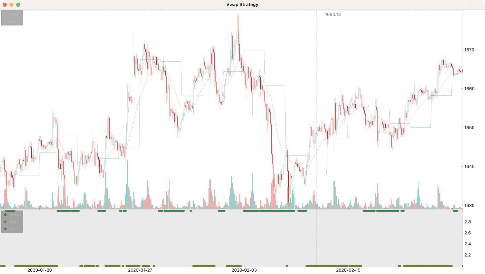
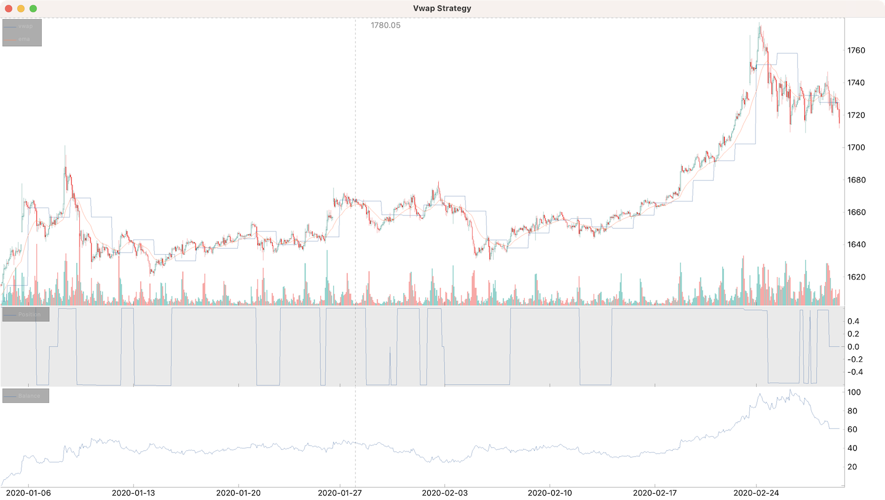

# VWAP for gold

Using 1h gold prices as input.

## Loading data

```python
from cipher import Cipher, Strategy


class VwapStrategy(Strategy):
    pass


def main():
    cipher = Cipher()
    cipher.add_source(
        "csv_file", path="data/gc1h.csv", ts_format="%d/%m/%YT%H:%M", delimiter=";"
    )
    cipher.set_strategy(VwapStrategy())
    cipher.run(start_ts="2020-01-01", stop_ts="2020-02-01")
    cipher.plot()


if __name__ == "__main__":
    main()
```

## Add VWAP

```python
import talib
from cipher import Cipher, Session, Strategy


class VwapStrategy(Strategy):
    def compose(self):
        df = self.datas.df

        df["price_volume"] = (df["high"] + df["low"]) / 2 * df["volume"]

        daily = df.resample("24h").agg({"volume": "sum", "price_volume": "sum"})

        daily = daily[daily["volume"] > 0]
        df["vwap"] = (daily["price_volume"] / daily["volume"]).shift(1)
        df["vwap"] = df["vwap"].fillna(method="ffill")
        hlc3 = (df["close"] + df["high"] + df["low"]) / 3

        df["ema"] = talib.EMA(hlc3, timeperiod=24)

        df["long"] = (hlc3 > df["vwap"]) & (hlc3 > df["ema"])
        df["short"] = (hlc3 < df["vwap"]) & (hlc3 < df["ema"])

        return df

    def on_long(self, row: dict, session: Session):
        pass

    def on_short(self, row: dict, session: Session):
        pass


def main():
    cipher = Cipher()
    cipher.add_source(
        "csv_file", path="data/gc1h.csv", ts_format="%d/%m/%YT%H:%M", delimiter=";"
    )
    cipher.set_strategy(VwapStrategy())
    cipher.run(start_ts="2020-01-01", stop_ts="2020-02-28")
    cipher.plot(rows=[["ohlcv", "vwap", "ema"], ["signals"]])


if __name__ == "__main__":
    main()
```



## Position

Take profit and stop loss 0.5% both. Trailing take profit.

```python
import talib
from cipher import Cipher, percent, Session, Strategy, quote


class VwapStrategy(Strategy):
    def compose(self):
        df = self.datas.df

        df["price_volume"] = (df["high"] + df["low"]) / 2 * df["volume"]

        daily = df.resample("24h").agg({"volume": "sum", "price_volume": "sum"})

        daily = daily[daily["volume"] > 0]
        df["vwap"] = (daily["price_volume"] / daily["volume"]).shift(1)
        df["vwap"] = df["vwap"].fillna(method="ffill")
        hlc3 = (df["close"] + df["high"] + df["low"]) / 3

        df["ema"] = talib.EMA(hlc3, timeperiod=24)

        df["long"] = (hlc3 > df["vwap"]) & (hlc3 > df["ema"])
        df["short"] = (hlc3 < df["vwap"]) & (hlc3 < df["ema"])

        df["entry"] = df["long"] | df["short"]

        return df

    def on_entry(self, row: dict, session: Session):
        if self.wallet.base != 0:
            return
        if row["long"]:
            session.position += quote(1000)
            session.take_profit = percent("0.5")
            session.stop_loss = percent("-0.5")
        else:
            session.position -= quote(1000)
            session.take_profit = percent("-0.5")
            session.stop_loss = percent("0.5")

    def on_take_profit(self, row: dict, session: Session):
        if session.is_long:
            session.take_profit = percent("0.5")
            session.stop_loss = percent("-0.5")
        else:
            session.take_profit = percent("-0.5")
            session.stop_loss = percent("0.5")


def main():
    cipher = Cipher()
    cipher.add_source(
        "csv_file", path="data/gc1h.csv", ts_format="%d/%m/%YT%H:%M", delimiter=";"
    )
    cipher.set_strategy(VwapStrategy())
    cipher.run(start_ts="2020-01-01", stop_ts="2020-02-28")
    cipher.plot(rows=[["ohlcv", "vwap", "ema"], ["position"], ["balance"]])


if __name__ == "__main__":
    main()
```



```text
----------------  ----------------------  -----
start             2020-01-02 17:00
stop              2022-11-21 22:00
period            1054d 5h
trades            1237
longs             576                     46.6%
shorts            661                     53.4%
period median     10h
period max        8d 11h
success           484                     39.1%
success median    4.97487500000000001
success max       61.6512699192029563
success row       6
failure           753                     60.9%
failure median    5.0000000000000000
failure max       5.00000000000000001
failure row       11
spf               0.6427622841965471
pnl               216.01161017633149651
volume            1350.7660692182473918
commission        0
exposed period    1005d 23h 29m 11s       95.0%
balance min       -0.0018596039285512234
balance max       378.80060115210904
balance drawdown  240.39084147373262
romad             0.8985850245045004
----------------  ----------------------  -----
```
