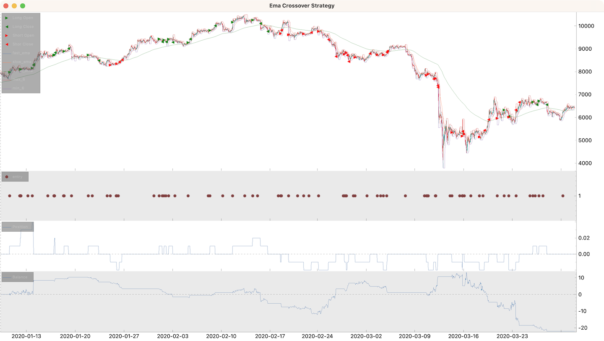

# Introduction


Cipher stands apart from most backtesting frameworks by focusing on position adjustments within the scope of individual trading sessions.

## Core Concepts

Cipher uses distinctive terminology that reflects its session-based approach:

- `buy` → `add to position`
- `sell` → `reduce position`
- `trade` → `session` (trading session)
- `close trade` → `close session` (achieved by adjusting position to 0) 
- `market order` → `transaction` (executed when position changes)
- `limit/stop orders` → `brackets`

## Key Features

- **Clean Architecture**: Well-structured, intuitive, and easily extensible
- **Concurrent Sessions**: Support for multiple simultaneous trading sessions
- **Advanced Exit Strategies**: Implement sophisticated strategies like trailing take profits
- **Multi-Source Data**: Support for multiple exchanges, symbols, and timeframes
- **Modular Design**: Signal generation and handling are cleanly separated
- **Simple Execution**: Run strategies with just `python my_strategy.py`
- **Cloud Ready**: Compatible with [Google Colab](https://colab.research.google.com/)
- **Flexible Visualization**: Built-in support for [finplot](https://github.com/highfestiva/finplot) and [mplfinance](https://github.com/matplotlib/mplfinance)

**Note**: Cipher is designed exclusively for backtesting and does not support forward testing, paper trading, or live trading.

## Example Strategy

Here's an EMA crossover strategy implementation:

```python
import numpy as np
import talib

from cipher import Cipher, Session, Strategy


class EmaCrossoverStrategy(Strategy):
    def __init__(self, fast_ema_length=9, slow_ema_length=21, trend_ema_length=200):
        self.fast_ema_length = fast_ema_length
        self.slow_ema_length = slow_ema_length
        self.trend_ema_length = trend_ema_length

    def compose(self):
        df = self.datas.df
        
        # Calculate EMAs using talib
        df["fast_ema"] = talib.EMA(df["close"], timeperiod=self.fast_ema_length)
        df["slow_ema"] = talib.EMA(df["close"], timeperiod=self.slow_ema_length)
        df["trend_ema"] = talib.EMA(df["close"], timeperiod=self.trend_ema_length)

        # Calculate crossover signal
        df["difference"] = df["fast_ema"] - df["slow_ema"]
        
        # Signal columns must be boolean type
        df["entry"] = np.sign(df["difference"].shift(1)) != np.sign(df["difference"])

        # Calculate support and resistance levels using talib
        df["max_6"] = talib.MAX(df["high"], timeperiod=6)
        df["min_6"] = talib.MIN(df["low"], timeperiod=6)

        return df

    def on_entry(self, row: dict, session: Session):
        # Long position: bullish crossover above trend
        if row["difference"] > 0 and row["close"] > row["trend_ema"]:
            session.position += "0.01"
            session.stop_loss = row["min_6"]
            session.take_profit = row["close"] + 1.5 * (row["close"] - row["min_6"])

        # Short position: bearish crossover below trend
        elif row["difference"] < 0 and row["close"] < row["trend_ema"]:
            session.position -= "0.01"
            session.stop_loss = row["max_6"]
            session.take_profit = row["close"] - 1.5 * (row["max_6"] - row["close"])

    # Optional: Custom signal handlers
    # def on_<signal>(self, row: dict, session: Session) -> None:
    #     """Custom signal handler called for each open session.
    #     Use this to adjust positions or modify brackets."""
    #     
    #     # Position adjustment examples:
    #     # session.position = 1            # Set absolute position
    #     # session.position = base(1)      # Same as above
    #     # session.position = '1'          # Auto-converts to Decimal
    #     # session.position = quote(100)   # Set position worth 100 quote units
    #     # session.position += 1           # Add to position
    #     # session.position -= Decimal('1.25')  # Reduce position
    #     # session.position += percent(50) # Increase by 50%
    #     # session.position *= 1.5         # Same as percent(50)
    #     pass

    # def on_take_profit(self, row: dict, session: Session) -> None:
    #     """Called when take profit is hit. Default: closes position.
    #     Override to adjust position/brackets and continue session."""
    #     session.position = 0

    # def on_stop_loss(self, row: dict, session: Session) -> None:
    #     """Called when stop loss is hit. Default: closes position.
    #     Override to adjust position/brackets and continue session."""
    #     session.position = 0

    # def on_stop(self, row: dict, session: Session) -> None:
    #     """Called when dataframe ends with open sessions.
    #     Use this to close positions, otherwise they're ignored."""
    #     session.position = 0


def main():
    # Initialize and configure Cipher
    cipher = Cipher()
    cipher.add_source("binance_spot_ohlc", symbol="BTCUSDT", interval="1h")
    cipher.set_strategy(EmaCrossoverStrategy())
    cipher.set_commission("0.00075")
    
    # Run backtest
    cipher.run(start_ts="2020-01-01", stop_ts="2020-04-01")
    
    # Display results
    print(cipher.sessions)
    print(cipher.stats)
    cipher.plot()


if __name__ == "__main__":
    main()
```



## Risk Disclaimer

**This software is intended for educational purposes only.** Never risk capital you cannot afford to lose. 

**USE THIS SOFTWARE AT YOUR OWN RISK.** The authors and affiliates assume no responsibility for trading results or financial losses incurred through the use of this software.
