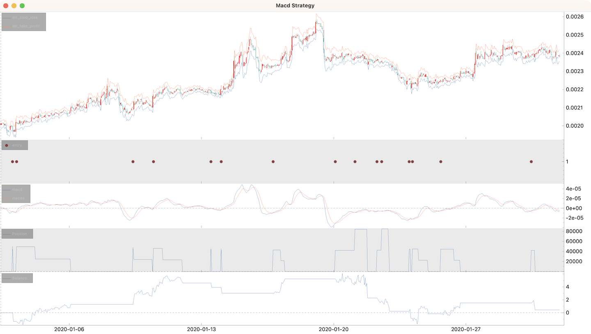

# Tutorial

This comprehensive tutorial demonstrates how to implement and test a Moving Average Convergence Divergence (MACD) trading strategy featuring ATR-based stop losses and a two-stage take profit system.

**Strategy Overview:**

- **Entry Signal**: MACD line crosses above signal line when both are below zero
- **Stop Loss**: Based on Average True Range (ATR) for dynamic risk management
- **Take Profit**: Two-stage system using ATR multiples for optimized exits

*Original strategy source: [Highly Profitable MACD Trading Strategy Proven 100 Trades (2 Stage Take Profit)](https://www.youtube.com/embed/Hgvt3lP7WxQ) on YouTube*

## Step 1: Creating the Strategy Template

Begin by creating a new strategy file:

```shell
cipher new macd
cat macd.py
```

This generates a basic strategy template:

```python
from cipher import Cipher, Strategy


class MacdStrategy(Strategy):
    pass


def main():
    cipher = Cipher()
    cipher.add_source("gateio_spot_ohlc", symbol="DOGE_USDT", interval="1h")
    cipher.set_strategy(MacdStrategy())
    cipher.run(start_ts="2020-01-01", stop_ts="2020-02-01")
    print(cipher.sessions)
    print(cipher.stats)
    cipher.plot()


if __name__ == '__main__':
    main()
```

Execute the initial backtest:

```shell
python macd.py
```


## Step 2: Implementing Technical Indicators

### Adding MACD and ATR Indicators

The strategy requires two key indicators:

- **MACD**: For trend identification and entry signals
- **ATR**: For dynamic stop loss and take profit levels

#### Interactive Development Approach

For experimentation, you can add a breakpoint in the `compose` method to test indicators interactively:

```python
class MacdStrategy(Strategy):
    def compose(self):
        df = self.datas.df
        breakpoint()  # Interactive testing point
        return df
```

#### Testing MACD Parameters

In the interactive session, test the MACD indicator:

```python
talib.MACD(df.close, fastperiod=12, slowperiod=26, signalperiod=9)
# Returns: macd, macd signal, and macd histogram
```

To explore indicator parameters, use Python's help system:

```python
import talib
help(talib.MACD)
```

### Initial Indicator Implementation

```python
class MacdStrategy(Strategy):
    def compose(self):
        df = self.datas.df
        df["macd"], df["macds"], _ = talib.MACD(
            df.close, fastperiod=12, slowperiod=26, signalperiod=9
        )
        return df


def main():
    # ... existing code ...
    cipher.plot(rows=[["ohlc"], ["macd", "macds"]])
```

### Refined Indicator Setup

For cleaner code and better performance, implement indicators directly with custom column names:

```python
class MacdStrategy(Strategy):
    def compose(self):
        df = self.datas.df

        # Calculate MACD components
        df["macd"], df["macds"], _ = talib.MACD(
            df.close, fastperiod=12, slowperiod=26, signalperiod=9
        )
        
        # Calculate Average True Range for volatility-based stops
        df["atr"] = talib.ATR(df["high"], df["low"], df["close"], timeperiod=14)

        return df


def main():
    cipher = Cipher()
    cipher.add_source("gateio_spot_ohlc", symbol="DOGE_USDT", interval="1h")
    cipher.set_strategy(MacdStrategy())
    cipher.run(start_ts="2020-01-01", stop_ts="2020-02-01")
    cipher.plot(rows=[["ohlc"], ["macd", "macds"]])
```


## Step 3: Generating Entry Signals

### Signal Logic

The entry signal triggers when:

1. MACD line crosses above the signal line (bullish crossover)
2. Both MACD and signal line are below zero (oversold conditions)

```python
class MacdStrategy(Strategy):
    def compose(self):
        df = self.datas.df

        # Technical indicators
        df["macd"], df["macds"], _ = talib.MACD(
            df.close, fastperiod=12, slowperiod=26, signalperiod=9
        )
        df["atr"] = talib.ATR(df["high"], df["low"], df["close"], timeperiod=14)

        # Entry signal generation
        difference = df["macds"] - df["macd"]
        cross = np.sign(difference.shift(1)) != np.sign(difference)
        df["entry"] = cross & (difference < 0) & (df["macds"] < 0)

        return df


def main():
    cipher = Cipher()
    cipher.add_source("gateio_spot_ohlc", symbol="DOGE_USDT", interval="1h")
    cipher.set_strategy(MacdStrategy())
    cipher.run(start_ts="2020-01-01", stop_ts="2020-02-01")
    cipher.plot(rows=[["ohlc"], ["signals"], ["macd", "macds"]])
```

## Step 4: Complete Strategy Implementation

### Full Strategy with Risk Management

```python
import numpy as np
import talib

from cipher import Cipher, Session, Strategy, quote


class MacdStrategy(Strategy):
    def compose(self):
        df = self.datas.df

        # Technical indicators
        df["macd"], df["macds"], _ = talib.MACD(
            df.close, fastperiod=12, slowperiod=26, signalperiod=9
        )
        df["atr"] = talib.ATR(df["high"], df["low"], df["close"], timeperiod=14)
        
        # Entry signal
        difference = df["macds"] - df["macd"]
        cross = np.sign(difference.shift(1)) != np.sign(difference)
        df["entry"] = cross & (difference < 0) & (df["macds"] < 0)

        # Risk management levels
        df["atr_stop_loss"] = df["close"] - (df["atr"] * 1.5)
        df["atr_take_profit"] = df["close"] + (df["atr"] * 1.5)

        return df

    def on_entry(self, row: dict, session: Session):
        """Execute entry logic with risk management setup"""
        # Position sizing: $100 worth of the asset
        session.position = quote(100)
        
        # Set initial risk management levels
        session.stop_loss = row["atr_stop_loss"]
        session.take_profit = row["atr_take_profit"]
        
        # Store second-stage targets
        session.meta["next_take_profit"] = (
            row["close"] + (row["atr_take_profit"] - row["close"]) * 2
        )
        session.meta["next_stop_loss"] = row["close"]  # Breakeven stop

    def on_take_profit(self, row: dict, session: Session):
        """Implement two-stage take profit system"""
        if session.meta["next_take_profit"]:
            # First take profit: reduce position by 50%
            session.position *= 0.5
            
            # Set second stage targets
            session.take_profit = session.meta["next_take_profit"]
            session.stop_loss = session.meta["next_stop_loss"]  # Move to breakeven
            
            # Clear second stage flag
            session.meta["next_take_profit"] = None
        else:
            # Second take profit: close remaining position
            session.position = 0


def main():
    cipher = Cipher()
    cipher.add_source("gateio_spot_ohlc", symbol="DOGE_USDT", interval="1h")
    cipher.set_strategy(MacdStrategy())
    cipher.run(start_ts="2025-01-01", stop_ts="2025-02-01")
    
    # Comprehensive plotting
    cipher.plot(
        rows=[
            ["ohlc", "atr_stop_loss", "atr_take_profit"],   # Price action with levels
            ["signals"],                                    # Entry signals
            ["macd", "macds"],                              # MACD indicator
            ["position"],                                   # Position size over time
            ["balance"],                                    # Portfolio balance
        ]
    )
    
    # Performance analysis
    print(cipher.sessions)
    print(cipher.stats)


if __name__ == "__main__":
    main()
```



```text
Session                Period          PnL
---------------------  --------  ---------
long 2020-01-03 00:00  1h        -1.35068
long 2020-01-03 05:00  2d 21h     2.65973
long 2020-01-09 09:00  1d 1h      2.51076
long 2020-01-10 11:00  1d 13h     0.787893
long 2020-01-13 12:00  1h        -0.678198
long 2020-01-14 01:00  1h        -0.916931
long 2020-01-16 19:00  15h        2.21554
long 2020-01-20 02:00  1d 17h    -1.82047
long 2020-01-21 03:00  16h       -1.11205
long 2020-01-22 07:00  15h       -1.10829
long 2020-01-22 13:00  10h       -0.977476
long 2020-01-24 00:00  2h        -1.09632
long 2020-01-24 04:00  20h        0.706303
long 2020-01-25 16:00  1d 1h      1.70895
long 2020-01-30 11:00  5h        -1.09761
----------------  ---------------------  ------
start             2020-01-02 09:00
stop              2020-01-31 23:00
period            29d 14h
trades            15
longs             15                     100.0%
shorts            0
period median     15h
period max        2d 21h
success           6                      40.0%
success median    1.9622442059571628645
success max       2.659732540861812779
success row       3
failure           9                      60.0%
failure median    1.097612065354000837
failure max       1.820469798657718121
failure row       5
spf               0.6666666666666666
pnl               0.431161233126911900
commission        0E-18
balance min       -1.8459700380155368
balance max       6.108997031624028
balance drawdown  7.844823888438853
romad             0.054961238041599234
----------------  ---------------------  ------
```

## Exercise

- Try different symbols, intervals, date ranges
- Experiment with different MACD parameters (fast/slow/signal periods)
- Test alternative volatility measures for stop loss calculation
- Implement shorting
- Add market regime detection for adaptive strategy behavior
