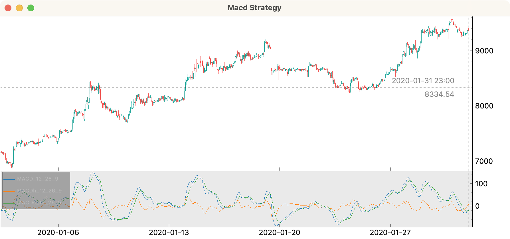

# Tutorial

Here we step-by-step test an MACD strategy with stop loss based on ATR and 2 stages take profit.

The strategy was found here:
<iframe width="480" height="270" src="https://www.youtube.com/embed/Hgvt3lP7WxQ" frameborder="0" allowfullscreen></iframe>
<br />

## Creating a new strategy file

```shell
cipher new macd
cat macd.py
```

```python
from cipher import Cipher, Strategy


class MacdStrategy(Strategy):
    pass


def main():
    cipher = Cipher()
    cipher.add_source('binance_spot_ohlc', symbol='BTCUSDT', interval='1h')
    cipher.set_strategy(MacdStrategy())
    cipher.run(start_ts='2020-01-01', stop_ts='2020-02-01')
    print(cipher.sessions)
    print(cipher.stats)
    cipher.plot()


if __name__ == '__main__':
    main()
```

Let's use hourly DOGEUSDT ohlc from GateIO:
```python
cipher.add_source('gateio_spot_ohlc', symbol='DOGE_USDT', interval='1h')
```

And run the backtest:
```shell
python macd.py
```


## Adding indicators

We have to add `MACD` and `ATR` indicators. To achieve this, the compose method has to be edited.
One way to experiment with indicators is to start an interactive session inside compose:

```python
class MacdStrategy(Strategy):
    def compose(self):
        df = self.datas.df

        import pdb; pdb.set_trace()

        return df
```

Then try to type:
```python
df.ta.macd()
# returns a dataframe with next columns: MACD_12_26_9, MACDh_12_26_9, MACDs_12_26_9
```

If you want to know the indicator parameters, use `help` in a Python REPL:
```python
import pandas_ta as ta
help(ta.macd)
# macd(close, fast=None, slow=None, signal=None, talib=None, offset=None, **kwargs)
#     Moving Average Convergence Divergence (MACD)
# ...
```

In order to see the `MACD`, we have to add it to the dataframe and add another row to plot:
```python
class MacdStrategy(Strategy):
    def compose(self):
        df = self.datas.df

        return df.merge(df.ta.macd(), left_index=True, right_index=True)


def main():
    # ...
    cipher.plot(rows=[['ohlc'], ['MACD_12_26_9', 'MACDh_12_26_9', 'MACDs_12_26_9']])
```



We don't need the histogram, so `MACDh_12_26_9` can be excluded, and let's rename
the remaining `MACD` columns to `macd` and `macds` (signal), and add `ATR`.

```python
class MacdStrategy(Strategy):
    def compose(self):
        df = self.datas.df

        macd_df = df.ta.macd()
        df["macd"] = macd_df["MACD_12_26_9"]
        df["macds"] = macd_df["MACDs_12_26_9"]

        df["atr"] = df.ta.atr()

        return df


def main():
    cipher = Cipher()
    cipher.add_source("gateio_spot_ohlc", symbol="DOGE_USDT", interval="1h")
    cipher.set_strategy(MacdStrategy())
    cipher.run(start_ts="2020-01-01", stop_ts="2020-02-01")
    cipher.plot(rows=[["ohlc"], ["macd", "macds"]])
```

## Signals

The entry signal for long: macd crosses macds from below when macds < 0.

Add the `entry` signal and the `signals` row to plot:
```python
class MacdStrategy(Strategy):
    def compose(self):
        df = self.datas.df

        macd_df = df.ta.macd()
        df["macd"] = macd_df["MACD_12_26_9"]
        df["macds"] = macd_df["MACDs_12_26_9"]
        difference = df["macds"] - df["macd"]
        cross = np.sign(difference.shift(1)) != np.sign(difference)

        df["entry"] = cross & (difference < 0) & (df["macds"] < 0)

        df["atr"] = df.ta.atr()

        return df


def main():
    cipher = Cipher()
    cipher.add_source("gateio_spot_ohlc", symbol="DOGE_USDT", interval="1h")
    cipher.set_strategy(MacdStrategy())
    cipher.run(start_ts="2020-01-01", stop_ts="2020-02-01")
    cipher.plot(rows=[["ohlc"], ["signals"], ["macd", "macds"]])
```

## Position manipulation

```python
import numpy as np

from cipher import Cipher, Session, Strategy, quote


class MacdStrategy(Strategy):
    def compose(self):
        df = self.datas.df

        macd_df = df.ta.macd()
        df["macd"] = macd_df["MACD_12_26_9"]
        df["macds"] = macd_df["MACDs_12_26_9"]
        difference = df["macds"] - df["macd"]
        cross = np.sign(difference.shift(1)) != np.sign(difference)

        df["entry"] = cross & (difference < 0) & (df["macds"] < 0)

        df["atr"] = df.ta.atr()
        df["atr_stop_loss"] = df["close"] - (df["atr"] * 1.5)
        df["atr_take_profit"] = df["close"] + (df["atr"] * 1.5)

        return df

    def on_entry(self, row: dict, session: Session):
        # add DOGE worth 100USD
        session.position = quote(100)
        # set brackets
        session.stop_loss = row["atr_stop_loss"]
        session.take_profit = row["atr_take_profit"]
        # remember the next_stop loss and take_profit for the session
        session.meta["next_take_profit"] = (
            row["close"] + (row["atr_take_profit"] - row["close"]) * 2
        )
        session.meta["next_stop_loss"] = row["close"]

    def on_take_profit(self, row: dict, session: Session):
        if session.meta["next_take_profit"]:
            session.position *= 0.5
            session.take_profit = session.meta["next_take_profit"]
            session.meta["next_take_profit"] = None
            session.stop_loss = session.meta["next_stop_loss"]
        else:
            session.position = 0


def main():
    cipher = Cipher()
    cipher.add_source("gateio_spot_ohlc", symbol="DOGE_USDT", interval="1h")
    cipher.set_strategy(MacdStrategy())
    cipher.run(start_ts="2020-01-01", stop_ts="2020-02-01")
    cipher.plot(
        rows=[
            ["ohlc", "atr_stop_loss", "atr_take_profit"],
            ["signals"],
            ["macd", "macds"],
            ["position"],
            ["balance"],
        ]
    )
    print(cipher.sessions)
    print(cipher.stats)


if __name__ == "__main__":
    main()
```


```text
Session                Period          PnL
---------------------  --------  ---------
long 2020-01-03 00:00  1h        -1.35068
long 2020-01-03 05:00  2d 21h     2.65973
long 2020-01-09 09:00  1d 1h      2.51076
long 2020-01-10 11:00  1d 13h     0.787893
long 2020-01-13 12:00  1h        -0.678198
long 2020-01-14 01:00  1h        -0.916931
long 2020-01-16 19:00  15h        2.21554
long 2020-01-20 02:00  1d 17h    -1.82047
long 2020-01-21 03:00  16h       -1.11205
long 2020-01-22 07:00  15h       -1.10829
long 2020-01-22 13:00  10h       -0.977476
long 2020-01-24 00:00  2h        -1.09632
long 2020-01-24 04:00  20h        0.706303
long 2020-01-25 16:00  1d 1h      1.70895
long 2020-01-30 11:00  5h        -1.09761
----------------  ---------------------  ------
start             2020-01-02 09:00
stop              2020-01-31 23:00
period            29d 14h
trades            15
longs             15                     100.0%
shorts            0
period median     15h
period max        2d 21h
success           6                      40.0%
success median    1.9622442059571628645
success max       2.659732540861812779
success row       3
failure           9                      60.0%
failure median    1.097612065354000837
failure max       1.820469798657718121
failure row       5
spf               0.6666666666666666
pnl               0.431161233126911900
commission        0E-18
balance min       -1.8459700380155368
balance max       6.108997031624028
balance drawdown  7.844823888438853
romad             0.054961238041599234
----------------  ---------------------  ------
```

## Exercise

- Try different symbols, intervals, date ranges
- Set commission
- Implement shorting
- Add `EMA200` and only long when price is above `EMA200`
